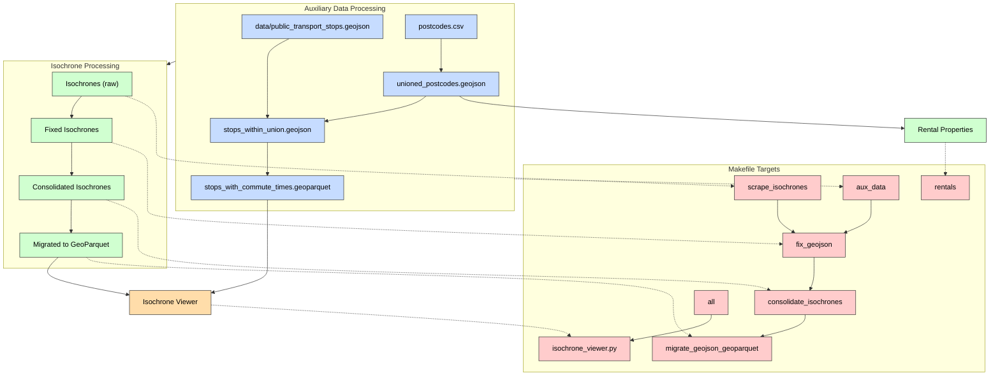

# Isochrone Visualization Tool

This project provides tools for geocoding addresses and calculating isochrones using the MapBox API.  
The results are visualized using a Holoviz Panel app with the PyDeck / Deck.gl component.

## Features

- Geocode addresses from a YAML file using the Google Maps API
- Calculate "Commuting Contours"
- Calculate isochrones for different transport modes (foot, car, bike) and time limits
- Visualize isochrones using a Holoviz Panel app and PyDeckGL

## Requirements

- Python 3.12 or higher
- MapBox API key
- Google Maps API Key
- `uv` installed (for dependency management)

## Installation

1. Clone this repository:

   ```sh
   git clone <repository-url>
   cd isochrones
   ```

2. The project uses standardized inline script metadata [PEP-723](https://peps.python.org/pep-0723/#example):

   ```python
   # /// script
   # requires-python = ">=3.12"
   # dependencies = [
   #   "package1>=1.0.0",
   #   "package2>=2.0.0",
   # ]
   # ///
   ```

   This allows the scripts to be run directly with `uv run` which will automatically install the required dependencies.

3. Create a `.env` file with your API keys:

   ```sh
   cp .env.example .env
   # Edit .env to add your API keys
   ```

## License

[MIT License](LICENSE)

## Acknowledgements

This project uses the API for geocoding and isochrone calculation.

- [MapBox Isochrone](https://docs.mapbox.com/api/navigation/isochrone/)

It also makes use of Google Directions API

- [Google Maps Directions API (Legacy)](https://developers.google.com/maps/documentation/directions)

## Makefile Build Artifact Flow

The following diagram illustrates the flow of build artifacts and their dependencies in the Makefile:



This diagram shows how the various data files and processes are connected in the build system:

1. **Auxiliary Data Processing** - Creating and processing postcode boundaries and public transport stops
2. **Isochrone Processing** - Fetching, fixing, and consolidating the isochrones for visualization
3. **Makefile Targets** - The actual make targets that coordinate the workflow
4. **Final Outputs** - The isochrone viewer and processed rental properties data

   The diagram shows both the conceptual data flow (solid arrows) as well as the relationship between implementation and Makefile targets (dotted arrows). The color coding distinguishes between:

- Data files (light blue)
- Process nodes (light green)
- Output nodes (light orange)
- Makefile targets (light red)

Running `make all` will execute the entire workflow from beginning to end, while individual targets can be run separately as needed.

## RESEARCH

- https://foursquare.com/
- https://sqlrooms.org/
-
