# New Lease On Life 🏘️

Silly little GIS project to help me narrow down finding a rental suitable for me as I am moving to Melbourne.

I don't really know the area so what better way to familiarise myself than to explore it through data?

When looking at an area, how do I know if it is a bargain or overpriced? 

It sure would be handy to have median rental and sales data for the last 10-20 years by suburb and LGA and dwelling type and size right? Thanks VicGov Open Data!

## Features

- Geocode addresses from a YAML file using the Google Maps API
- Calculate "Commuting Contours"
- Calculate isochrones for different transport modes (foot, car, bike) and time limits
- Visualize isochrones using DeckGL.JS
- Process Victorian real estate and transport data
- Generate interactive web visualization with DuckDB integration

## Data Pipeline Architecture

This project implements a comprehensive geospatial data processing pipeline:

```mermaid
flowchart TD
    %% External Data Sources
    subgraph "External Data Sources"
        ESRI[ESRI Shapefiles<br/>ABS Boundary Data]
        APIs[GraphHopper/Mapbox APIs<br/>Isochrone Data]
        EXCEL[Excel Files<br/>Rental/Sales Data]
        GOOGLE[Google Maps API<br/>Geocoding & Directions]
    end

    %% Base Data Conversion Layer
    subgraph "Layer 1: Base Data Conversion"
        EXPORT[export_shapefiles.py<br/>ESRI → GeoJSON/Parquet]
    end

    %% Boundary Processing Layer
    subgraph "Layer 2: Boundary Processing"
        STATE[extract_state_polygons.py<br/>Extract State Polygons]
        VICTORIA[extract_boundaries_by_state.py<br/>Filter to Victoria]
        POSTCODES[extract_postcode_polygons.py<br/>Filter by Transport Access]
    end

    %% Transport Data Processing Layer
    subgraph "Layer 3: Transport Data Processing"
        STOPS[extract_stops_within_union.py<br/>Filter Transport Stops]
        TRANSIT[stops_by_transit_time.py<br/>Calculate Commute Times]
    end

    %% API Data Processing Layer
    subgraph "Layer 4: API Data Fetching"
        BATCH[batch_isochrones_for_stops.py<br/>Fetch Isochrones from APIs]
    end

    %% Data Cleaning Layer
    subgraph "Layer 5: Data Cleaning & Consolidation"
        FIX[fix_geojson.py<br/>Standardize GeoJSON]
        CONSOLIDATE[consolidate_isochrones.py<br/>Merge by Mode/Time]
    end

    %% Format Optimization Layer
    subgraph "Layer 6: Format Optimization"
        MIGRATE[migrate_geojson_geoparquet.py<br/>Convert to Parquet]
    end

    %% Rental/Sales Pipeline
    subgraph "Layer 7: Rental/Sales Processing"
        DISCOVER[discover_rental_sales_data.py<br/>Analyze Excel Structure]
        PROCESS[process_rental_sales_excel.py<br/>Transform Excel → CSV]
        GENERATE[generate_rental_sales_geojson.py<br/>Create GeoJSON]
        DUCKDB[convert_rental_sales_to_duckdb.py<br/>Create DuckDB]
    end

    %% Property Analysis Layer
    subgraph "Layer 8: Property Analysis"
        GEOCODE[geocode_candidates.py<br/>Property Geocoding]
    end

    %% Webapp Support Scripts (Not in main pipeline)
    subgraph "Webapp Support Scripts"
        MAPPINGS[create_js_mappings.py<br/>Generate JS Mappings]
        COVERAGE[enhanced_polygon_coverage.py<br/>Coverage Analysis]
    end

    %% Output Data
    subgraph "Final Outputs"
        WEBAPP[sites/webapp/data/<br/>Static Site Data]
        DATA[data/ directories<br/>Processed Geospatial Data]
        GEOMAPPINGS[geospatial_mappings.js<br/>Frontend Mappings]
    end

    %% Data Flow Connections
    ESRI --> EXPORT
    EXPORT --> STATE
    EXPORT --> VICTORIA
    EXPORT --> POSTCODES
    STATE --> VICTORIA
    POSTCODES --> STOPS
    STOPS --> TRANSIT

    APIs --> BATCH
    BATCH --> FIX
    FIX --> CONSOLIDATE
    CONSOLIDATE --> MIGRATE
    CONSOLIDATE --> GEOCODE

    EXCEL --> DISCOVER
    DISCOVER --> PROCESS
    PROCESS --> GENERATE
    PROCESS --> DUCKDB

    COVERAGE --> MAPPINGS
    MAPPINGS --> GEOMAPPINGS

    MIGRATE --> WEBAPP
    TRANSIT --> WEBAPP
    GEOCODE --> WEBAPP
    DUCKDB --> WEBAPP
    GENERATE --> DATA
    CONSOLIDATE --> DATA

    %% External API connections
    GOOGLE -.-> TRANSIT
    GOOGLE -.-> GEOCODE
    APIs -.-> BATCH

    %% Styling
    classDef external fill:#e1f5fe
    classDef processing fill:#f3e5f5
    classDef output fill:#e8f5e8
    classDef api fill:#fff3e0
    classDef webapp fill:#fce4ec

    class ESRI,EXCEL,GOOGLE,APIs external
    class EXPORT,STATE,VICTORIA,POSTCODES,STOPS,TRANSIT,BATCH,FIX,CONSOLIDATE,MIGRATE,DISCOVER,PROCESS,GENERATE,DUCKDB,GEOCODE processing
    class WEBAPP,DATA,GEOMAPPINGS output
    class MAPPINGS,COVERAGE webapp
```

## Requirements

- Python 3.12 or higher
- MapBox API key
- Google Maps API Key
- `uv` installed (for dependency management)

## License

[MIT License](LICENSE)

## Acknowledgements

This project uses the API for isochrone calculation.

- [MapBox Isochrone](https://docs.mapbox.com/api/navigation/isochrone/)

It also makes use of Google Directions API as well as Geocoding addresses.

- [Google Maps Directions API (Legacy)](https://developers.google.com/maps/documentation/directions)

Thanks to Victoria Government:

- [Public Transport Lines and Stops (GeoJSON)](https://discover.data.vic.gov.au/dataset/public-transport-lines-and-stops)
- Median Rental Data
    - [Quarterly Median Rent by LGA](https://discover.data.vic.gov.au/dataset/rental-report-quarterly-quarterly-median-rents-by-lga)
    - [Quarterly Annual-Moving-Median Rent by Suburb](https://discover.data.vic.gov.au/dataset/rental-report-quarterly-moving-annual-rents-by-suburb)
- Median Sales Data
    - [Median Annual Sales by Suburb - House](https://discover.data.vic.gov.au/dataset/victorian-property-sales-report-median-house-by-suburb-time-series)
    - [Median Annual Sales by Suburb - Unit](https://discover.data.vic.gov.au/dataset/victorian-property-sales-report-median-unit-by-suburb-time-series)
    - [Median Annual Sales by Suburb - Vacant Land](https://discover.data.vic.gov.au/dataset/victorian-property-sales-report-median-vacant-land-by-suburb-time-series)

Thanks to Australian Bureau of Statistics and their "Non-ABS Structures":

- ["Suburbs and Localities (SAL)" Polygon Boundaries (SHP Files)](https://www.abs.gov.au/statistics/standards/australian-statistical-geography-standard-asgs-edition-3/jul2021-jun2026/access-and-downloads/digital-boundary-files)
- [LGA Polygon Boundaries (SHP Files)](https://www.abs.gov.au/statistics/standards/australian-statistical-geography-standard-asgs-edition-3/jul2021-jun2026/access-and-downloads/digital-boundary-files)
- ["Postal Areas (POA)" Polygon Boundaries (SHP Files)](https://www.abs.gov.au/statistics/standards/australian-statistical-geography-standard-asgs-edition-3/jul2021-jun2026/access-and-downloads/digital-boundary-files)

Also thanks to GeoPandas for the easy assist manipulating all of these geospatial files

- [GeoPandas](https://geopandas.org/en/stable/)

