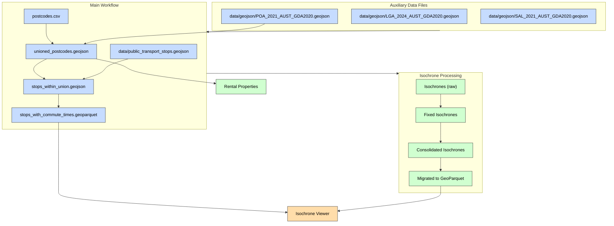

# Isochrone Visualization Tool

This project provides tools for geocoding addresses and calculating isochrones using the GraphHopper API. The results are cached in a DuckDB database with spatial extension and can be visualized using a FastAPI server with a Holoviz Panel app.

## Features

- Geocode addresses from a YAML file using the GraphHopper API
- Calculate isochrones for different transport modes (foot, car, bike) and time limits
- Cache results in a DuckDB database with spatial support
- Visualize isochrones using a FastAPI server with a Holoviz Panel app and PyDeckGL

## Requirements

- Python 3.12 or higher
- GraphHopper API key
- `uv` installed (for dependency management)

## Installation

1. Clone this repository:
   ```
   git clone <repository-url>
   cd isochrones
   ```

2. The project uses standardized inline script metadata:
   ```python
   # /// script
   # requires-python = ">=3.12"
   # dependencies = [
   #   "package1>=1.0.0",
   #   "package2>=2.0.0",
   # ]
   # ///

   This allows the scripts to be run directly with `uv run` which will automatically install the required dependencies.

4. Create a `.env` file with your GraphHopper API key:
   ```
   cp .env.example .env
   # Edit .env to add your GraphHopper API key from GraphHopper website
   ```

## Usage

### 1. Geocode Addresses and Calculate Isochrones

Create a YAML file with your addresses (see `addresses.yaml` for an example) and run:

```bash
uv run geocode_isochrones.py
```

This will:
- Geocode each address in your YAML file
- Calculate isochrones for each address with different transport modes
- Cache results in a DuckDB database

### 2. Visualize Isochrones with FastAPI Server

Start the FastAPI server to visualize the isochrones:

```bash
uv run isochrone_server.py
```

Then open http://localhost:8000/app in your web browser.

### 3. Standalone Isochrone Viewer

For a lightweight visualization without needing a FastAPI server, use the standalone Panel app:

```bash
uv run isochrone_viewer.py
```

This will:
- Launch a direct Panel app in your default web browser
- Allow you to select addresses and transport modes
- Visualize isochrones using PyDeckGL
- Read directly from the DuckDB database


This script also uses inline script metadata, ensuring that duckdb and the spatial extension are available when you run it with uv.

### 5. Export Shapefiles to GeoJSON

To convert shapefiles to GeoJSON format, use the export_shapefiles.py script:

```bash
# Export all shapefiles in the data directory
uv run export_shapefiles.py

# Export a specific shapefile
uv run export_shapefiles.py --single-file data/LGA_2024_AUST_GDA2020/LGA_2024_AUST_GDA2020.shp

# Simplify geometries to reduce file size
uv run export_shapefiles.py --simplify 0.0001

# Only export files with a specific suffix
uv run export_shapefiles.py --filter-suffix AUST_GDA2020.shp
```

This will:
- Convert shapefiles to GeoJSON format
- Optionally simplify geometries to reduce file size
- Output to the `data/geojson` directory by default
- Reproject to WGS84 for web compatibility if needed


## License

[MIT License](LICENSE)

## Acknowledgements

This project uses the GraphHopper API for geocoding and isochrone calculation.
- [GraphHopper Geocoding API](https://docs.graphhopper.com/openapi/geocoding/)
- [GraphHopper Isochrone API](https://docs.graphhopper.com/openapi/isochrones/)


# More interesting datasets
- https://discover.data.vic.gov.au/dataset/block-level-energy-consumption-modelled-on-building-attributes-2011-baseline
- https://discover.data.vic.gov.au/dataset/street-names
- https://discover.data.vic.gov.au/dataset/public-barbecues
- https://discover.data.vic.gov.au/dataset/cafe-restaurant-bistro-seats
- https://discover.data.vic.gov.au/dataset/residential-dwellings
- https://discover.data.vic.gov.au/dataset/live-music-venues
- https://discover.data.vic.gov.au/dataset/trees-with-species-and-dimensions-urban-forest
- https://discover.data.vic.gov.au/dataset/childcare-centres
- https://discover.data.vic.gov.au/dataset/playgrounds
- https://discover.data.vic.gov.au/dataset/block-level-energy-consumption-modelled-on-building-attributes-2026-projection-business-as-usua
- https://discover.data.vic.gov.au/dataset/street-lights-with-emitted-lux-level-council-owned-lights-only
- https://discover.data.vic.gov.au/dataset/street-addresses
- https://discover.data.vic.gov.au/dataset/bar-tavern-pub-patron-capacity
- https://discover.data.vic.gov.au/dataset/outdoor-artworks
- https://discover.data.vic.gov.au/dataset/landmarks-and-places-of-interest-including-schools-theatres-health-services-sports-facilities-p
- https://discover.data.vic.gov.au/dataset/public-open-space-400m-walkable-catchment
- https://discover.data.vic.gov.au/dataset/open-space

- https://discover.data.vic.gov.au/dataset/fus-land-use

- https://discover.data.vic.gov.au/dataset/?sort=score+desc%2C+metadata_modified+desc&q=&organization=crime-statistics-agency&groups=&res_format=
- https://discover.data.vic.gov.au/dataset/government-dates-api-data
- https://discover.data.vic.gov.au/dataset/popular-baby-names
- https://discover.data.vic.gov.au/dataset/local-government-performance-reporting
- https://discover.data.vic.gov.au/dataset/school-locations-2021
- https://discover.data.vic.gov.au/dataset/victorian-government-school-zones-2026

- https://discover.data.vic.gov.au/dataset/rental-report-quarterly-quarterly-median-rents-by-lga
- https://discover.data.vic.gov.au/dataset/rental-report-quarterly-moving-annual-rents-by-suburb
- https://discover.data.vic.gov.au/dataset/rental-report-quarterly-data-tables
- https://discover.data.vic.gov.au/dataset/rental-report-quarterly-affordable-lettings-by-lga
- https://discover.data.vic.gov.au/dataset/victorian-property-sales-report-yearly-summary
- https://discover.data.vic.gov.au/dataset/victorian-property-sales-report-median-house-by-suburb
- https://discover.data.vic.gov.au/dataset/victorian-property-sales-report-median-unit-by-suburb
- https://discover.data.vic.gov.au/dataset/victorian-property-sales-report-median-vacant-land-by-suburb
- https://discover.data.vic.gov.au/dataset/victorian-property-sales-report-median-vacant-land-by-suburb-time-series
- https://discover.data.vic.gov.au/dataset/victorian-property-sales-report-median-unit-by-suburb-time-series
- https://discover.data.vic.gov.au/dataset/victorian-property-sales-report-time-series
- https://discover.data.vic.gov.au/dataset/victorian-property-sales-report-median-house-by-suburb-time-series

- https://discover.data.vic.gov.au/dataset/vpa-precinct-boundaries

- https://discover.data.vic.gov.au/dataset/vif2023-lga-population-household-dwelling-projections-to-2036
- https://discover.data.vic.gov.au/dataset/vif2023-lga-population-age-sex-projections-to-2036


- https://discover.data.vic.gov.au/dataset/vicmap-property
- https://discover.data.vic.gov.au/dataset/vicmap-hydro
- https://discover.data.vic.gov.au/dataset/vicmap-planning
- https://discover.data.vic.gov.au/dataset/vicmap-address

- https://discover.data.vic.gov.au/dataset/vicmap-elevation-rest-api
- https://discover.data.vic.gov.au/dataset/vicmap-property-parcel-polygon
- https://discover.data.vic.gov.au/dataset/vicmap-property-property-polygon
- https://discover.data.vic.gov.au/dataset/vicmap-property-property-table
- https://discover.data.vic.gov.au/dataset/vicmap-elevation-1-5-contours-relief

## Makefile Build Artifact Flow

The following diagram illustrates the flow of build artifacts and their dependencies in the Makefile:



This diagram shows how the various data files and processes are connected in the build system:

1. **Auxiliary Data Files** - Shapefiles converted to GeoJSON format
2. **Main Workflow** - Filtering public transport stops based on postcode boundaries
3. **Isochrone Processing** - Fixing and consolidating the isochrones for visualization
4. **Final Outputs** - The isochrone viewer and processed rental properties data

Running `make all` will execute the entire workflow from beginning to end, while individual targets can be run separately as needed.