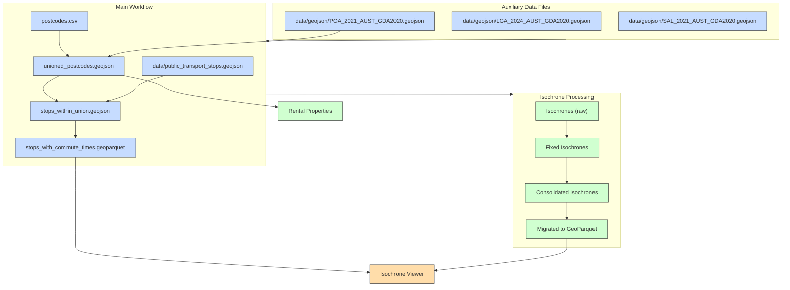

# Flow

```mermaid
flowchart TB

    %% Main auxiliary data files
    POA["data/geojson/POA_2021_AUST_GDA2020.geojson"]
    LGA["data/geojson/LGA_2024_AUST_GDA2020.geojson"]
    SAL["data/geojson/SAL_2021_AUST_GDA2020.geojson"]
    STOPS["data/public_transport_stops.geojson"]

    %% Intermediate artifacts
    POSTCODES["postcodes.csv"]
    UNION["unioned_postcodes.geojson"]
    STOPS_UNION["stops_within_union.geojson"]
    STOPS_TIMES["stops_with_commute_times.geoparquet"]

    %% Process nodes
    ISOCHRONES["Isochrones (raw)"]
    FIXED_ISOCHRONES["Fixed Isochrones"]
    CONSOLIDATED["Consolidated Isochrones"]
    GEOPARQUET["Migrated to GeoParquet"]
    RENTALS["Rental Properties"]

    %% Subgraph for auxiliary data files
    subgraph AuxData["Auxiliary Data Files"]
        POA
        LGA
        SAL
    end

    %% Subgraph for main flow
    subgraph MainFlow["Main Workflow"]
        POSTCODES --> UNION
        POA --> UNION
        UNION --> STOPS_UNION
        STOPS --> STOPS_UNION
        STOPS_UNION --> STOPS_TIMES
    end

    %% Subgraph for isochrone processing
    subgraph IsochroneProcessing["Isochrone Processing"]
        ISOCHRONES --> FIXED_ISOCHRONES
        FIXED_ISOCHRONES --> CONSOLIDATED
        CONSOLIDATED --> GEOPARQUET
    end

    %% Dependencies between subgraphs
    AuxData --> MainFlow
    MainFlow --> IsochroneProcessing

    %% Final visualization and rentals are independent tasks
    STOPS_TIMES --> VIEWER["Isochrone Viewer"]
    GEOPARQUET --> VIEWER
    UNION --> RENTALS

    %% Style definitions
    classDef dataFile fill:#c6dcff,stroke:#333,stroke-width:1px
    classDef processNode fill:#d0ffd0,stroke:#333,stroke-width:1px
    classDef outputNode fill:#ffddaa,stroke:#333,stroke-width:1px

    %% Apply styles
    class POA,LGA,SAL,STOPS,POSTCODES,UNION,STOPS_UNION,STOPS_TIMES dataFile
    class ISOCHRONES,FIXED_ISOCHRONES,CONSOLIDATED,GEOPARQUET,RENTALS processNode
    class VIEWER outputNode
```
